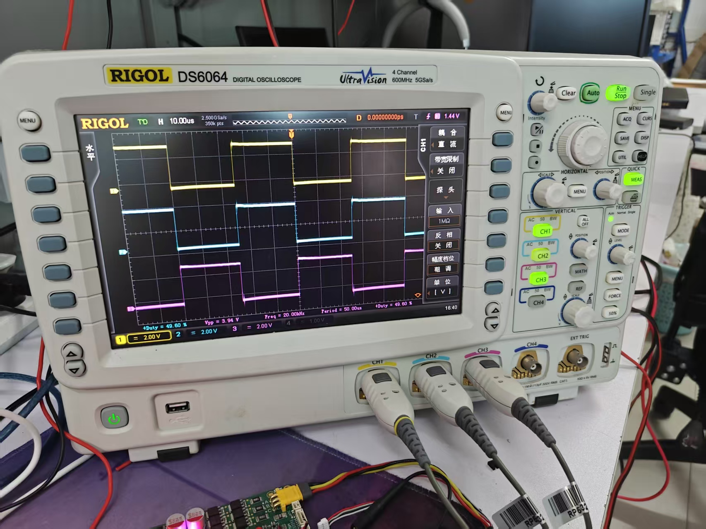
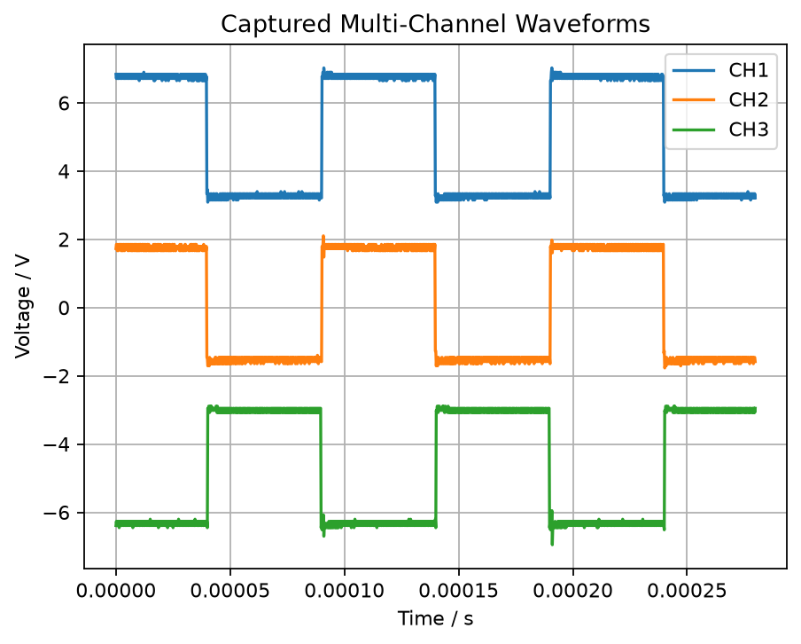

# DS6064 Scope Bridge

让 Codex 或其他 AI Agent 安全调用 RIGOL DS6064 / DS6000 示波器。

DS6064 Scope Bridge 是一个面向 AI 辅助嵌入式调试的 USB-TMC 示波器桥接项目。它提供安全的 JSON CLI 和 Codex Skill，让用户可以用自然语言发起测量请求，例如：

```text
用示波器读取 CH1、CH2、CH3 的波形，并分析三路 PWM 的时序关系。
```

项目会通过 PyVISA / NI-VISA 访问示波器，读取内置测量值，采集波形，并生成 JSON、CSV、PNG、manifest 组成的证据包，方便人或其他 AI 继续分析。



## 能做什么

- 让 AI 读取 DS6064 的频率、周期、占空比、Vpp 等内置测量值。
- 将 CH1-CH4 波形采集成 CSV 和 PNG 文件。
- 用 `snapshot` 一次生成多通道时序分析证据包。
- 把 `manifest + CSV + PNG` 交给其他 AI 做进一步波形分析。
- 通过 JSON 输出、命令封装、文件锁和 watchdog 降低 USB-TMC 卡死风险。
- 作为 Codex Skill 使用，用自然语言驱动示波器，而不是手动发送 SCPI。

这个项目适合嵌入式开发者做 PWM、时钟、CAN 物理层、电源纹波、过冲、振铃、边沿质量和多通道时序关系分析。

## 产出效果

下面是一张由本项目生成的三通道采集图：



一次典型采集会在项目根目录的 `outputs/` 文件夹下生成类似这些文件：

```text
outputs/csv/20260711_170952_CH1_CH2_CH3_snapshot.csv
outputs/images/20260711_170952_CH1_CH2_CH3_snapshot.png
outputs/manifests/20260711_170952_CH1_CH2_CH3_snapshot.json
```

实际采集产物默认被 Git 忽略。README 中展示的图片只是为了让第一次打开仓库的人快速理解输出效果。

## 工作链路

```text
用户自然语言
-> Codex / AI Agent
-> rigol-ds6064-scope skill
-> Python JSON CLI
-> PyVISA + NI-VISA
-> USB-TMC
-> RIGOL DS6064 / DS6000 示波器
-> 测量值 / CSV / PNG / manifest
-> AI 工程分析结论
```

当前项目只聚焦 USB-TMC 链路，不实现 LAN/TCPIP 控制路径。

## 环境要求

- Windows 主机。
- Python 3.10+。
- 已安装并可用的 NI-VISA。
- `requirements.txt` 中的 Python 依赖。
- RIGOL DS6064 或兼容的 DS6000 系列示波器。
- 使用示波器后面板 USB DEVICE 口连接电脑。

运行 Python 控制命令前，请关闭 Ultra Sigma、NI MAX 或其他可能占用 VISA 会话的软件。

## 快速开始

克隆仓库并安装依赖：

```powershell
git clone https://github.com/3463331795/DS6064-Scope-Bridge.git
cd DS6064-Scope-Bridge
python -m venv .venv
.\.venv\Scripts\python.exe -m pip install -r requirements.txt
Copy-Item .env.example .env
```

编辑 `.env`，填入自己的 VISA 资源地址：

```env
RIGOL_CONNECTION=USB
RIGOL_SCOPE_RESOURCE=USB0::0x1AB1::0x04B0::<YOUR_SERIAL>::INSTR
RIGOL_SCOPE_TIMEOUT_MS=20000
RIGOL_DEFAULT_CHANNEL=CHANnel1
RIGOL_CLEAR_ON_CONNECT=0
RIGOL_VISA_ACCESS_MODE=no_lock
RIGOL_VISA_LIBRARY=auto
RIGOL_CLI_TIMEOUT_MS=30000
RIGOL_LOCK_TIMEOUT_MS=5000
```

如果还不知道资源地址，先运行：

```powershell
.\.venv\Scripts\python.exe src\scope_cli.py list
```

然后检查连接：

```powershell
.\.venv\Scripts\python.exe src\scope_cli.py probe-open --query-idn --open-timeout-ms 5000
.\.venv\Scripts\python.exe src\scope_cli.py health --channels CHANnel1 CHANnel2 CHANnel3 --points 64
```

## 常用命令

读取示波器身份信息：

```powershell
.\.venv\Scripts\python.exe src\scope_cli.py idn
```

读取 CH1 的内置测量值：

```powershell
.\.venv\Scripts\python.exe src\scope_cli.py freq --channel CHANnel1
.\.venv\Scripts\python.exe src\scope_cli.py period --channel CHANnel1
.\.venv\Scripts\python.exe src\scope_cli.py duty --channel CHANnel1
.\.venv\Scripts\python.exe src\scope_cli.py vpp --channel CHANnel1
```

采集单通道波形：

```powershell
.\.venv\Scripts\python.exe src\scope_cli.py capture --channel CHANnel1 --points 1200
```

采集三通道波形，并合并成一个 CSV 和一个 PNG：

```powershell
.\.venv\Scripts\python.exe src\scope_cli.py capture-multi --channels CHANnel1 CHANnel2 CHANnel3 --points 1200
```

生成推荐给 AI 使用的完整证据包：

```powershell
.\.venv\Scripts\python.exe src\scope_cli.py snapshot --channels CHANnel1 CHANnel2 CHANnel3 --points 1200
```

读取最近一次保存的 manifest，不访问硬件：

```powershell
.\.venv\Scripts\python.exe src\scope_cli.py latest
```

## 作为 Codex Skill 使用

仓库中已经包含 Skill 文件：

```text
SKILL.md
.agents/skills/rigol-ds6064-scope/SKILL.md
```

当 Codex 能看到这个仓库时，和 RIGOL DS6064、DS6000、示波器、USB-TMC、PyVISA、SCPI、PWM、CAN、电源纹波、波形采集相关的请求，都应该触发 `rigol-ds6064-scope` skill。

典型使用方式：

```text
用户：用示波器看一下 CH1 的 PWM 是否正常。
Codex：idn -> summary/freq/duty/vpp -> capture 或 snapshot -> 给出分析结论
```

多通道分析时，可以这样问：

```text
读取 CH1、CH2、CH3 的波形，生成一份可以交给其他 AI 分析的证据包。
```

Skill 的设计原则是优先调用封装好的 CLI，不直接裸发 SCPI。只有用户明确要求底层恢复操作，并且命令经过安全规则检查时，才考虑低层 SCPI。

## JSON 输出格式

所有 CLI 命令都会输出一个 JSON 对象。

成功：

```json
{"ok": true, "data": {}}
```

失败：

```json
{"ok": false, "error": "message"}
```

AI Agent 应先解析 `ok` 字段，不要依赖 stderr 做机器判断。产生文件的命令会返回项目相对路径形式的 `csv_path`、`image_path` 和 `manifest_path`。

更详细的 CLI 合同见 [docs/CLI_CONTRACT.md](docs/CLI_CONTRACT.md)。

## 安全边界

默认 AI 流程允许读取测量值、采集波形、保存 CSV/PNG/manifest，并分析保存的数据。

尽量避免自动执行会改变示波器状态的命令。`autoscale` 会改变示波器显示和测量状态，只有在用户明确允许时才使用。

CLI 默认拦截这些危险 SCPI 模式：

```text
*RST
:STOR
:SAVE
:LOAD
:DISK
:SYSTem:SECure
```

不要对同一台示波器并发运行多个 AI/tool 调用。所有访问硬件的命令都由 `outputs/logs/` 下的锁文件和 watchdog 保护。

## USB-TMC 排障

USB-TMC 不是普通串口，常见问题如下：

| 现象 | 可能原因 | 处理方式 |
|---|---|---|
| `list` 看不到示波器 | 驱动、线缆或端口问题 | 检查 NI-VISA、USB DEVICE 口和设备管理器 |
| `list` 能看到但 `idn` 卡住 | 其他软件占用 VISA 会话 | 关闭 Ultra Sigma / NI MAX，重新插拔 USB |
| 读取波形超时 | 点数太大或 timeout 太短 | 先用 `--points 1200`，保持 timeout 约 20000 ms |
| 偶发卡住 | 并发调用或会话残留 | 一次只跑一个命令，依赖 CLI 文件锁 |
| 长时间后设备消失 | Windows USB 省电 | 关闭 USB 选择性暂停 |

如果 VISA 打开过程不稳定，可以运行：

```powershell
.\.venv\Scripts\python.exe src\scope_cli.py probe-open --query-idn --open-timeout-ms 5000
```

## 离线验证

修改代码前后建议运行：

```powershell
.\.venv\Scripts\python.exe -m compileall src tests
.\.venv\Scripts\python.exe -m unittest discover -s tests -v
```

## 仓库结构

```text
.
|-- README.md
|-- SKILL.md
|-- requirements.txt
|-- .env.example
|-- src/
|   |-- rigol_ds6064.py
|   |-- scope_cli.py
|   |-- safety.py
|   `-- waveform_analysis.py
|-- tests/
|-- docs/
|   |-- CLI_CONTRACT.md
|   `-- assets/
|-- outputs/
|   |-- csv/
|   |-- images/
|   |-- logs/
|   `-- manifests/
`-- .agents/skills/rigol-ds6064-scope/
```

所有示波器采集产物都应该放在项目根目录下的 `outputs/` 文件夹中。CLI 会从自身文件位置推导项目根目录，不依赖固定盘符路径。

原厂手册文件，例如 `DS6000_Datasheet_EN.pdf` 和 `DS6000_ProgrammingGuide_EN.chm`，默认被 Git 忽略，不属于源码发布内容。

## License

MIT License，见 [LICENSE](LICENSE)。
